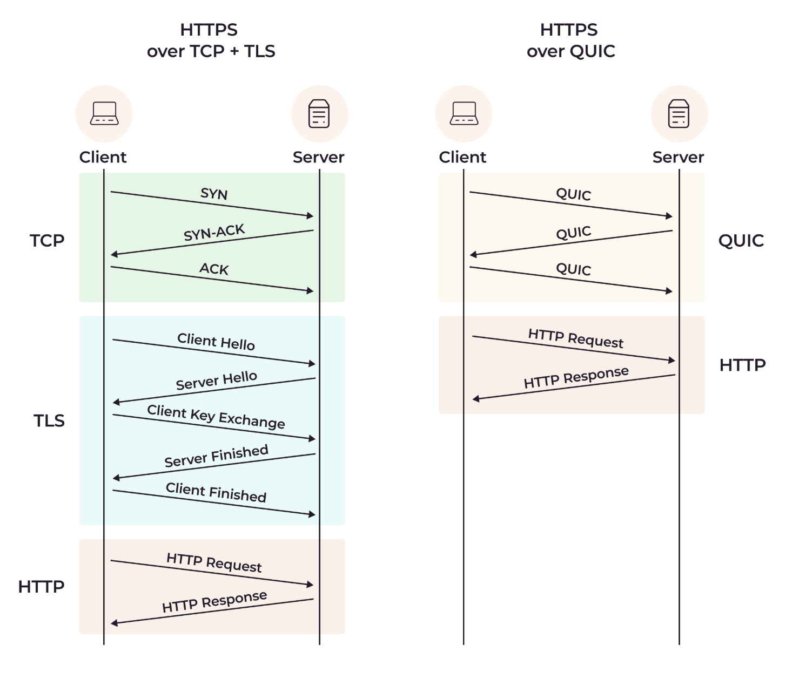
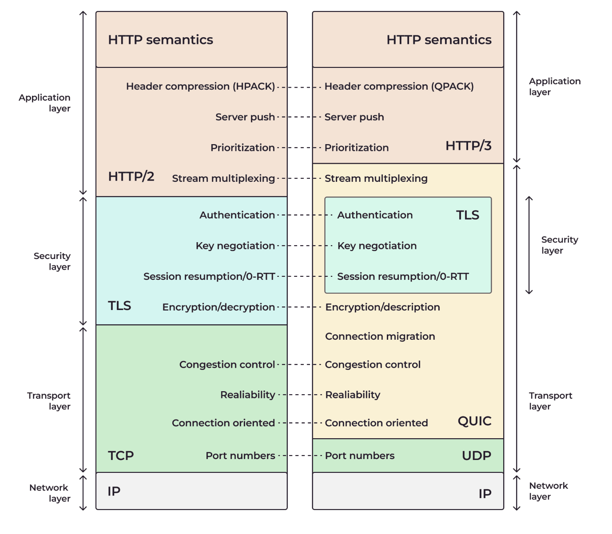

# W1-W2

## Status Codes
<details>
<summary>1xx informational</summary>

The request was received and understood.\
It alerts the client to wait for a final response.

</details>

<details>
<summary>2xx: successful</summary>

- 200: OK
- 201: Created
- 202: Accepted
- 204: No Content

</details>

<details>
<summary>3xx: redirection</summary>

- 301: Moved Permanently
- 304: Not Modified\
  No need to retransmit the resource since the client still has a previously-downloaded copy.

</details>

<details>
<summary>4xx: client error</summary>

- 400 Bad Request
- 401 Unauthorized
- 403 Forbidden
- 404 Not Found
- 409 Conflict\
  conflict in the current state of the resource eg. edit conflict between multiple simultaneous updates.
- 422 Unprocessable\
  Form request validation fail.
- 429 Too Many Request\
  rate-limiting schemes

</details>

<details>
<summary>5xx: server error</summary>

- 500 Internal Server Error
- 502 Bad Gateway\
  The server was acting as a gateway or proxy and received an invalid response from the upstream server
- 503 Service Unavailable\
  The server cannot handle the request (eg. temporarily overloaded or down for maintenance)
- 504 Gateway Timeout\
  The server was acting as a gateway or proxy and did not receive a timely response from the upstream server.


</details>

---

## Methods

- GET
- POST / custom method
- PUT (full update) / PATCH (partial update)
- DELETE
- (OPTIONS)?
- (HEAD)?

#### [`Options` method](https://developer.mozilla.org/en-US/docs/Web/HTTP/Methods/OPTIONS)

- requests permitted communication options for a given URL or server.
- A: used to test the allowed HTTP methods for a req url
- B: determine whether a req would succeed when making a CORS pre-flighted req

Eg. Allowed Request methods

```yaml
# REQUEST
OPTIONS / HTTP/2
Host: example.org
User-Agent: curl/8.7.1
Accept: */*

# RESPONSE
HTTP/1.1 204 No Content
Allow: OPTIONS, GET, HEAD, POST
Cache-Control: max-age=604800
Date: Thu, 13 Oct 2016 11:45:00 GMT
Server: EOS (lax004/2813)
```

Eg. Pre-flighted requests in CORS

```yaml
# REQUEST
OPTIONS /resources/post-here/ HTTP/1.1
Host: bar.example
Accept: text/html,application/xhtml+xml,application/xml;q=0.9,*/*;q=0.8
Accept-Language: en-us,en;q=0.5
Accept-Encoding: gzip,deflate
Connection: keep-alive
Origin: https://foo.example
Access-Control-Request-Method: POST
Access-Control-Request-Headers: content-type,x-pingother

# RESPONSE
HTTP/1.1 200 OK
Date: Mon, 01 Dec 2008 01:15:39 GMT
Server: Apache/2.0.61 (Unix)
Access-Control-Allow-Origin: https://foo.example
Access-Control-Allow-Methods: POST, GET, OPTIONS
Access-Control-Allow-Headers: X-PINGOTHER, Content-Type
Access-Control-Max-Age: 86400
Vary: Accept-Encoding, Origin
Keep-Alive: timeout=2, max=100
Connection: Keep-Alive
```

#### [`HEAD` method](https://developer.mozilla.org/en-US/docs/Web/HTTP/Methods/HEAD)

- requests the **metadata** of a resource in the form of headers that the server would have sent if the GET method was used instead
- CANT have message body
- used where a URL might produce a large download
- eg. read the Content-Length header to check the file size before downloading

```yaml
# REQUEST
HEAD / HTTP/1.1
Host: example.com
User-Agent: curl/8.6.0
Accept: */*

# RESPONSE
HTTP/1.1 200 OK
Content-Type: text/html; charset=UTF-8
Date: Wed, 04 Sep 2024 10:33:11 GMT
Content-Length: 1234567
```

---

## Find practical usages in our application and think about why are we using it like that.

## [RESTful APIs](https://konghq.com/learning-center/api-gateway/what-is-restful-api)

Representational State Transfer (REST)

- Find resources using URLs
- In JSON/XML format
- The Communication is stateless -> every req is independent
- Standard HTTP methods manage resources in a clear way
- Clients receive clear error messages

#### Comparison with SOAP

SOAP = Simple Object Access Protocol

- With strict rules for XML messaging
- More secured: eg. digital signature & encryption
- Make robust tools, but it can also feel complicated

REST: More like design style under certain principles

#### REST advantages

- Simplicity
- Flexibility
- Scalability
- Performance
- Portability

#### Role of Middleware in REST Integration

- authentication
- logging
- changing requests / responses (eg. Header)
- managing errors

## Explain what is the core concept for a restful API

## Exercise: Design a set of RESTful APIs for a e-commerce website

- Should be as detail as possible

## [API Auth Methods](https://konghq.com/blog/engineering/common-api-authentication-methods)

**Basic Authentication**

- send username & password every API call with HTTP header

**API Keys**

- an unique identification code used to auth API user
- cons:
    - Lacks authorization: when API key get hacked and hold by malicious users
    - User identification: API keys can only identify projects, not individual users

**Digest Authentication**

- verify an individual's credentials using a web browser.
- saves an encrypted version of a username and password to a server

**OAuth 2.0**

- is an authorization protocol and not an authentication protocol.

**JWT**

**OpenID Connect (OIDC)**

# W3-W4

## HTTP 1.1

ref: https://www.explainthis.io/zh-hant/swe/http1.0-http1.1-http2.0-difference

HTTP1 > HTTP1.1 (1999)

- **keep-alive**
  默認使用持久連接，同一個 TCP 連接多個 HTTP Req

- **Status Code 100** (Continue)
  Client 先發送只含 header、不含 body 的 Req， Server 回覆 100 表示許可， Client 發送正文，reduce bandwidth cost.

- **Cache Strategy**
  - HTTP1: `If-Modified-Since`, `Expires`
  - HTTP1.1: introduce `Etag`, `If-Unmodified-Since`, `If-Match`, `If-None-Match`

- **Host**
  HTTP1 只有 IP，URL 不帶 hostname。

- **More Req Method**
  `PUT`, `PATCH`, `DELETE`, `CONNECT`, `TRACE`, `OPTIONS`

HTTP1.1 > HTTP2 (2015)

> !NOTE: Faster and more Efficient than HTTP1.1!!!

- Avoid head-of-line blocking with **Request multiplexing**
  - HTTP1.1 pipeline allows multiple HTTP request with single TCP connection;
    However, received Req **order** is not ignorable, which bring difficulty in implementation.
    Also, if one req takes longer time to handle, may leads to **HOL** (Head of line blocking)

  - HTTP2 **Request multiplexing** -> 1 TCP conn can send / receive several req in the same time.

- HTTP1 use plain txt messages, while HTTP2 uses binary format, which are divided into frames, and mixed during transmission.

- Prioritize Request
  - HTTP2 Req possess `stream ID`, which allows server to recognize and prioritize the request.

- Compress Header with HPACK algo, increase security & decrease bandwidth

- Server Push
  - eg. 主動推送 `index.html`, `styles.css`，在一輪 Req 中拿到所有資源

## Common Request Headers

### Authorization
  - `Authorization: <auth-scheme> <authorization-parameters>`
  - if not provide, server with respond with 401
    `WWW-Authenticate: Basic realm="User Visible Realm"`

  - **`Basic`** scheme
    - encode `username:password` with base64

  - **`Digest`** scheme
    - Enhances Basic Authentication by using MD5 hashing

    ```yaml
    Authorization: Digest username=<username>,
      realm="<realm>",
      uri="<url>",
      algorithm=<algorithm>,
      nonce="<nonce>",
      nc=<nc>,
      cnonce="<cnonce>",
      qop=<qop>,  # quality of protection
      response="<response>",
      opaque="<opaque>"
    ```

  - **`Bearer`**
    - No strict rule, 只要 Server Verify 即可

### Accept

- In request/response header
- indicate which content types (MIME) is accepted by sender.
  (MIME: `type/subtype;parameter=value`)
- Available choice for `Content-Type` header.

Syntax:

```yaml
Accept: <media-type>/<MIME_subtype>
# eg.
Accept: text/html

Accept: <media-type>/*
# eg.
Accept: image/*   # png/svg/gif/jpeg

Accept: */*

# Multiple types, weighted with the quality value syntax
Accept: text/html, application/xhtml+xml, application/xml;q=0.9, image/webp, */*;q=0.8
# q -> Quality values (q-values/q-factors)
# describe the order of priority of values in a comma-separated list
# digit between 0 to 1
# default 1 when not presented
```

### User-Agent

[MDN doc](https://developer.mozilla.org/en-US/docs/Web/HTTP/Reference/Headers/User-Agent)

> A characteristic string that lets servers and network peers identify the application, os, vendor and/or version of the requesting user agent.


Syntax:

```yaml
User-Agent: <product> / <product-version> <comment>

# eg.
User-Agent: Mozilla/5.0 (<system-information>) <platform> (<platform-details>) <extensions>
User-Agent: Mozilla/5.0 (Macintosh; Intel Mac OS X 10_15_7) AppleWebKit/537.36 (KHTML, like Gecko) Chrome/134.0.0.0 Safari/537.36
```

### Content-Type

[MDN doc](https://developer.mozilla.org/en-US/docs/Web/HTTP/Reference/Headers/Content-Type)

> used to indicate the original media type of a resource **before** any content encoding is applied.

- Mostly used in `POST`, `PUT` request
- If server dont support -> `415` (Unsupported Media Type)
- `Content-Encoding` -> lists the encodings and the order in which they have been applied to a resource

Syntax:

```HTTP
Content-Type: <media-type>

# eg.
Content-Type: text/html; charset=utf-8
Content-Type: multipart/form-data; boundary=ExampleBoundaryString
```

eg.
```HTTP
POST /upload HTTP/1.1
Content-Length: 428
Content-Type: multipart/form-data; boundary=abcde12345
--abcde12345
Content-Disposition: form-data; name="id"
Content-Type: text/plain
123e4567-e89b-12d3-a456-426655440000
--abcde12345
Content-Disposition: form-data; name="address"
Content-Type: application/json
{
  "street": "3, Garden St",
  "city": "Hillsbery, UT"
}
--abcde12345
Content-Disposition: form-data; name="profileImage "; filename="image1.png"
Content-Type: application/octet-stream
{…file content…}
--abcde12345--
```

- `application/x-www-form-urlencoded`
  When forms don't involve file uploads and are using simpler fields

### `ETag`

[MDN doc](https://developer.mozilla.org/en-US/docs/Web/HTTP/Reference/Headers/ETag)

- Entity Tag, an identifier for a specific version of resource.
- Make cache more efficient, save bandwidth.
- If the resource at a given URL changes, a new Etag value must be generated.

Syntax

```HTTP
ETag: W/"<etag_value>"
# W = weak validator, easy to gen but far less useful

ETag: "<etag_value>"

# eg.
ETag: "33a64df551425fcc55e4d42a148795d9f25f89d4"
ETag: W/"0815"
```

- `etag_value`
  - string of ASCII characters
  - typical is a hash of content / hash of last modification timestamp / or just a revision num.

#### Avoiding mid-air collisions

- `Etag` + `If-Match` header -> check freshness
- If not match -> resource has been edited -> `412` Precondition Failed

#### Caching of unchanged resources

- `If-None-Match`: "etag_value"
- if resource stays -> `304` Not Modified without body

#### Cons

- Consistency issue in load balancing structure
  (The way Etag was generated is server-specific)
- Harder to manage (one more factor to handle)

### Find practical usages in our application and think about why are we using it like that.

## Common Response Headers

### Cache-Control

[MDN doc](https://developer.mozilla.org/en-US/docs/Web/HTTP/Reference/Headers/Cache-Control)

> holds directives (instructions) in both requests and responses that control caching in browsers and shared caches (e.g., Proxies, CDNs).

#### Syntax:

- case-insensitive, but lowercase is recommended.
- comma-separated in multiple directives (eg. `Cache-control: max-age=180, public`).
- Typically, arg for directives are int (or optional).

#### Vocabulary

- Shared cache
  - Cache that exists between the origin server and clients (eg. Proxy, CDN)
  - Stored and reuse it with multiple users.

- Private cache / local cache / browser cache
  - Cache that exists in the client.
  - Reuse personalized content for single user.

- Store Response (usually, cache = storing a response)
- Reuse Response
- Revalidate Response
  Ask server whether or not the stored response is still fresh.
- Fresh Response
  Indicate the resp is fresh -> usable
- Stale Response

- Age
  the time since resp **was generated**.

#### Response Directive

- `max-age=N`
  - if set -1 or non-int -> unspecified the caching behavior

- `s-maxage=N` 
  (s = shared)
  - how long the response remains fresh in a **shared cache**
  - Top validation factor for shared cache if present (max-age, Expires)

- `no-cache`
  - can store response, but must be validated with the origin server before each reuse
    (even when the cache is disconnected!)

- `must-revalidate`
  - If the response becomes stale, it must be validated with the origin server before reuse
  - used with `max-age`

- `no-store`
  - any caches of any kind (private or shared) should not store this response

- `private`
  - the response can be stored only in a private cache
  - if not set -> public cache

- `public`

#### Request Directive

- `no-cache`
  - asks caches to validate the response with the origin server before reuse
  - eg. force reloading page

- `no-store`

- `max-age=N`
  - indicates that the client allows a stored response that is generated on the origin server within N seconds
  - `max-age=0` -> reloading


### Expires

[MDN doc](https://developer.mozilla.org/en-US/docs/Web/HTTP/Reference/Headers/Expires)

> Contains the date/time after which the response is considered expired in the context of HTTP caching.

- value 0 -> expire!
- If `Cache-Control` and `Expires` both are present, `Cache-Control` takes precedence.

Syntax

```http
Expires: <day-name>, <day> <month> <year> <hour>:<minute>:<second> GMT

<!-- eg. -->
Expires: Wed, 21 Oct 2015 07:28:00 GMT
```

### Content-Type

- json
- form

### Find practical usages in our application and think about why are we using it like that.

# W5-W6

## Other HTTP variants

HTTP 2 vs. HTTP 3

### [What Is HTTP/3 and How Does It Differ from HTTP/2?](https://gcore.com/learning/what-is-http-3)

**HTTP3**

- established through `QUIC` over UDP
  - a transportation protocol
  - improved performance, reduced latency, enhanced security, better handling of network fluctuations

- UDP = user datagram protocol

- header compression (QPACK)

- connection ID

**HTTP over QUIC**

QUIC runs over UDP - a connectionless, lightweight protocol.

(QUIC = Quick UDP Internet Connection)

- TCP prevents packet loss, yet cause head-of-line blocking
- QUIC on the other hand, is connection-less -> enables multiplexing at transportation layer, NO HOL blocking issues.

- UDP doesn't require client-server connection, facilitate data delivery via optimal routes, yet no data re-transmission mechanism -> risk of data packet loss
- QUIC multiplexed connections at the higher level, enable the transmission of **multiple data streams** simultaneously and independently.
- QUIC prevent data loss in one stream without affecting another.

- QUIC offers bandwidth estimation from both server and client directions
  - determine how much data a network can transmit within a givin session
  - forward error correction (FEC) capabilities (via FEC packets) to prevent errs in unstable network -> performance ++

**HTTP2 vs HTTP3**

| | HTTP/2 | HTTP3 |
| :-: | :-- | :-- |
|Transport Layer Protocol| TCP | QUIC over UDP |
| Multiplexing & head-of-line (HOL) | Often encounters head-of-line blocking issues for multiplexed streams due to limitations in byte stream abstraction | Offers multiplexing without head-of-line blocking due to **UDP’s out-of-order delivery** |
| Error handling | Fewer error handling capabilities | Enhanced error handling capabilities due to QUIC |
| TLS encryption | optional | embedded in QUIC and by default in HTTP/3 |
| Connection migration | Does not support connection migration | Supports seamless connection migration via **connection IDs (CIDs)** |




**Header Compression**

- Compress headers (IP/UDP/TCP headers) before sent
- HTTP2: `HPACK` (prone to HOL)
- HTTP3: `QPACK`

**Server Push and Prioritization**

- Both support server push
- HTTP3 clients can set the number of acceptable pushes via **push stream ID** to reduce bandwidth waste.

**Stream Multiplexing**

- Both support multiplexing
- `HTTP/2` considers every request (including multiplexed ones) as a single byte stream
  -> cause HOL blocking
- `HTTP/3` UDP’s out-of-order delivery, each byte stream is transported independently

**TLS Encryption**

TLS = Transport Layer Security

- In HTTP/3, TLS encryption is provided by default via **QUIC’s key exchange mechanism**, which reduce risk of:
  - eavesdropping
  - data tampering
  - and other security threats

**Session Resumption/0-RTT**

- Session resumption
  reusing parameters used in previous exchanges without reinitiating a full handshake

- `HTTP/2` resumption: TLS session tickets mechanism
  At least two rounds of handshakes—TCP & TLS before reconnect

- `HTTP/3` resumption: QUIC’s 0-RTT (zero round trip time resumption)
  Enables clients to send encrypted data in the first packet of the handshake, allowing for faster resumption of previous sessions

**Other features in `HTTP/3`**

- Fewer Handshakes -> Faster Connection
- Seamless Connection Migration with CID
  - clients can maintain a stable connection without requiring new handshakes
  - when switch networks, simply updates the network info while keeping the same CID
  - particularly beneficial in scenarios such as switches from Wi-Fi
  - Also reduces the likelihood of connection hijacking or interception

## Security

TLS vs STS

TLS = Transport Layer Security
STS = Strict Transport Security

### [How TLS Works?](https://youtu.be/THxIyHz191A?si=X4Ab2rjkpBJDn8It)

- Upgraded version of SSL (Secure Sockets Layer)

- 3 function provided by TLS
  - Authentication
  - Data encryption
  - Data integrity (avoid being tampered)

#### TLS Session

- **Handshake phase**
  - Server provides TLS Certificate & public Key
  - Client check Cert integrity through **CA** (Certificate Authority)
  - Client gen random string then enc through public key
  - Server decrypt the enc-string with private key
  - Both Client & Server use rand-string + other info to gen identical **session key**

- **Encryption phase**
  - Use session key to encrypt / decrypt the data
  - NOTE: Symmetric encryption is faster than Asymmetric!!!

#### Certificate Authority

#### MAC: Message Authentication Code

- MAC key is generate during handshake
- encrypted msg -> hash func + MAC key -> MAC
- MAC is delivered along with enc data
- receiver then compare the MAC code and self-gen MAC from received enc-msg

### TLS

- TLS handshake
  - asymmetric cipher to establish specific shared key
  - further communication is encrypted using a symmetric cipher
  - client and server agree on several params:
    - supported cipher suites (ciphers and hash func)
    - server usually then provides identification in the form of a digital certificate (CA) + public encryption key
    - client generate session key, then encrypt it with public key, transport to server, decrypt with private key
- After handshake, use session key to encrypt and decrypt messages until the connection close.
  (symmetric-key algorithm)

### [MDN STS: Strict-Transport-Security](https://developer.mozilla.org/en-US/docs/Web/HTTP/Reference/Headers/Strict-Transport-Security)

> Response Header to inform browser that the site should be accessed using HTTPS,
  and that any future attempts to access it using HTTP should auto be upgraded to HTTPs.

```HTTP
Strict-Transport-Security: max-age=<expire-time>
Strict-Transport-Security: max-age=<expire-time>; includeSubDomains
Strict-Transport-Security: max-age=<expire-time>; includeSubDomains; preload
```

**Directives**

- `max-age=<exp-time>`
  The time, in seconds, that the browser should remember that a site is only to be accessed using HTTPS
  - IN SWAG: max-age = 63072000 sec = 17520 hr = 730 days

- `includeSubDomains`
  optional, specify this rule applies to all of the site's subdomains as well.

- `preload`
  - optional
  - When using preload, the max-age directive must be at least 31536000 (1 year), and the includeSubDomains directive must be present.
  - Used for HSTS policy, See [ref](https://developer.mozilla.org/en-US/docs/Web/HTTP/Reference/Headers/Strict-Transport-Security#preloading_strict_transport_security)

**Description**

- Man-in-the-middle may occur in the process of HTTP -> HTTPs redirection
- The STS header informs the browser that **it should never load a site using HTTP**,
  and should **automatically convert all attempts to access** the site using HTTP to HTTPS requests instead.
- Every time receive STS will refresh the expire time stored in browser
- To disable STS: just set exp time to 0

---

# W7-W8

## Websockets

### Socket Explain

[99% of Developers Don't Get Sockets](https://youtu.be/D26sUZ6DHNQ?si=8oi0CS9bvP2aptsN)

- Socket 直譯 = 插座，定義連接 process connection 的 interface (API)

> Sockets are an abstraction provided by OSs to enable communication between different processes,
  either on the same machine or over a network.

- Socket Address = software construct wraps a combination of
  - protocol (TCP / UDP)
  - IP address
  - Port number

- Sockets operate primarily at the **Transport Layer** (L4),
  App (L7) calls down to the Socket API, asking to send / receive data.
  Sockets would then wraps the data into TCP / UDP segments, add headers, and sends it to the Network Layer (L3).

- Server Side Socket Life Cycle:
  - `socket()`
    create a listening socket
  - `bind()`
    associate IP and port # with a socket
  - `listen()`
    wait for incoming connections
  - `accept()` 
    -> then create a new socket dedicated to the specific client communication,
       original socket continues to listening new req
  - the created socket becomes the channel through the communication:
    - `read()`
    - `write()`
  - This allows Server to handle multiple req concurrently
    (multithreading / multiprocessing)

- Use non-blocking IO or event-driven architecture to avoid idle waiting thread

- Client Side Socket:
  - `socket()`
  - `connect()`
    - `read()`
    - `write()`
  - `close()`
    close socket thread to free up resources
  
- High level view of a Socket: 5-tuple
  - Type of socket (TCP/UDP)
  - Local Port
  - Local IP address
  - Peer's Port (optional for UDP)
  - Peer's IP address (optional for UDP)

- **UDS**: Unix Domain Sockets
  - used for inter-process communication (IPC) on the same host
  - use a file path on the FS
    (eg. `/tmp/app.sock` as address)
  - faster because bypass network stack entirely, no IP routing or protocol overhead
  - Eg. PostgreSQL, Redis for local client-server communication

- NOTE: socket are inherently insecure, no encryption involved;
  security usually achieved via TLS.

### [How Web Sockets work | Deep Dive](https://youtu.be/G0_e02DdH7I?si=W804swdljCq_DqXo)

- Init the channel through **WS handshake**
  - client send `ws://*` GET request -> intention to upgrade to WS
    Headers:
    - `Connection: Upgrade`
    - `Upgrade: websocket`
    - `Sec-WebSocket-Key: <base64-encoded>` used for server to verify handshake data
    - `Sec-WebSocket-Protocol: chat, superchat`
    - `Sec-WebSocket-Versions: <int>`
  - Server receives:
    - Check the req headers
    HTTP/1.1 **101** Switching Protocols
    Response Headers:
    - `Connection: Upgrade`
    - `Upgrade: websocket`
    - `Sec-WebSocket-Accept: <base64-encoded>`
    - `Sec-WebSocket-Protocol: chat`

- URI format:
  - "ws://<host>:<port><path><queries>"   (port 80)
  - "wss://<host>:<port><path><queries>"  (port 443)

### [MDN: The WebSocket API (WebSockets)](https://developer.mozilla.org/en-US/docs/Web/API/WebSockets_API)

> The WebSocket API makes it possible to **open a two-way interactive communication session** between the user's browser and a server.

- WebSocket interface:
  - stable and has good browser and server support
  - doesn't support back-pressure when msg >> application capability to process
    -> occupy all sever resources for buffering msg

- WebSocketStream interface
  - a Promise-based alternative to WebSocket
  - uses the Streams API to handle receiving and sending messages
  - regulating the speed of reading or writing to avoid bottlenecks in the app

(**WebTransport API** is expected to replace the WebSocket API)

#### Interface

- **WebSocket**
  The primary interface for connecting to a WebSocket server and then sending and receiving data on the connection.

- **CloseEvent**
  The event sent by the WebSocket object when the connection closes.

- **MessageEvent**
  The event sent by the WebSocket object when a message is received from the server.

#### Related HTTP headers

Request Headers:

- **Sec-WebSocket-Key**
  - contains a nonce from the client
    (nonce: 在加密通訊只能使用一次的數字)
  - Used in the WS opening handshake to verify that the client explicitly intends to open a WS.
  - Added automatically by the browser.

- **Sec-WebSocket-Version**
  - the WS protocol understood by the client.
  - IN RESP: IF requested ver. is not supported by the server,
    lists the versions that the server supports

- **Sec-WebSocket-Protocol**
  - indicates the sub-protocols supported by the client in preferred order
  - IN RESP: indicates the sub-protocol selected by the server from the client's preferences

- **Sec-WebSocket-Extensions**
  - indicates the WS extensions supported by the client in preferred order
  - IN RESP: the extension selected by the server from the client's preferences

```bash
curl 'wss://soketi.swag.live/app/10000appKey?protocol=7&client=js&version=8.3.0&flash=false' \
  -H 'Upgrade: websocket' \
  -H 'Origin: https://swag.live' \
  -H 'Cache-Control: no-cache' \
  -H 'Accept-Language: zh-TW,zh;q=0.9,en-US;q=0.8,en;q=0.7' \
  -H 'Pragma: no-cache' \
  -H 'Connection: Upgrade' \
  -H 'Sec-WebSocket-Key: bBesL1lTV9UwGOYoIeG03A==' \
  -H 'User-Agent: Mozilla/5.0 (Macintosh; Intel Mac OS X 10_15_7) AppleWebKit/537.36 (KHTML, like Gecko) Chrome/135.0.0.0 Safari/537.36' \
  -H 'Sec-WebSocket-Version: 13' \
  -H 'Sec-WebSocket-Extensions: permessage-deflate; client_max_window_bits'
```

Response Headers:

- **Sec-WebSocket-Accept**
  - indicate that the server is willing to upgrade to a WS connection
  - value is calculated from the value of **Sec-WebSocket-Key** in the corresponding req

- **uWebSockets** (from gemini)
  - indicates that the server is using the [uWebSockets](https://github.com/uNetworking/uWebSockets) library

```http
HTTP/1.1 101 Switching Protocols

Sec-WebSocket-Accept: WAmTUzb8Ij4zQLqSh4dy8ZivGqo=
uWebSockets         : 20
Date                : Sun, 27 Apr 2025 12: 08: 49 GMT
Via                 : 1.1 google
Upgrade             : websocket
Connection          : Upgrade
Alt-Svc             : h3=":443"; ma=2592000, h3-29=":443"; ma=2592000
```

---

# Evaluations

- Must adequately understand each item.
- Must found enough practical usages to justify progress.
