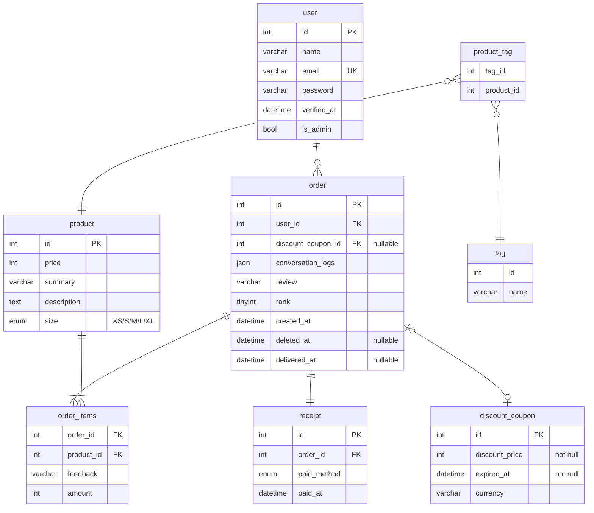

## Exercise: Design a set of RESTful APIs for a e-commerce website



### Admin features

#### [GET]`/api/admin/users`
  - admin see user list
  - queries:
    - page
  - <details>
    <summary>Resp schema</summary>

    ```json
    {
        "messages": "success",
        "data": [
            {
                "id": 1,
                "name": "username",
                "email": "example1@swag.live",
                "verified_at": "2025-03-21",
                "is_admin": true,
            },
            {
                "id": 2,
                "name": "username2",
                "email": "example2@swag.live",
                "verified_at": "2025-03-21",
                "is_admin": false,
            },
        ],
        "meta": {
            "totalRows": 110,
            "totalPages": 6,
            "currentPage": 1,
            "perPage": 20,
        },
    }
    ```

    </details>


#### [GET] `/api/admin/users/{user_id}`
  - see specific user profile
  - <details>
    <summary>Resp schema</summary>

    ```json
    {
        "messages": "success",
        "data": {
            "id": 1,
            "username": "admin",
            "email": "admin@example.io",
            "verified_at": "2025-03-11",
            "orders_count": 25
        }
    }
    ```

    </details>

#### [GET] `/api/admin/users/{user_id}/orders`
  - see user's order history
  - queries:
    - is_paid (true,false)
    - is_delivered (true,false)
    - is_deleted (true,false)
  - <details>
    <summary>Resp schema</summary>

    ```json
    {
        "messages": "success",
        "data": [
            {
              "id": 1,
              "user_id": 1,
              "created_at": "2025-03-01",
              "paid_at": "2025-03-01",
              "delivered_at": "2025-03-01",
              "deleted_at": "2025-03-01",
              "rank": 5,
            },
        ],
        "meta": {
            "totalRows": 110,
            "totalPages": 6,
            "currentPage": 1,
            "perPage": 20,
        },
    }
    ```

    </details>

- [GET] `/api/admin/users/{user_id}/orders/{order_id}`
  - see user's order detail
  - <details>
    <summary>Resp schema</summary>

    ```json
    {
        "messages": "success",
        "data": {
            "id": 1,
            "review": "Good",
            "rank": 5,
            "created_at": "2025-03-01 00:00:00",
            "delivered_at": null,
            "conversation_logs": [
                {
                    "from": "customer",
                    "created_at": "2025-03-01 11:11:11",
                    "content": "Is my order in preparation?",
                    "read_at": "2025-03-01 11:12:00",
                },
                {
                    "from": "seller",
                    "created_at": "2025-03-01 12:00:00",
                    "content": "Not yet.",
                    "read_at": null,
                },
            ],
            "discountCoupon": {
                "id": 1,
                "discountPrice": 90,
                "unit": "TWD",
                "expiredAt": "2025-01-01 00:00:00",
            },
            "receipt": {
                "id": 1,
                "paid_method": "CREDIT_CARD",
                "paid_at": "2025-01-01 00:00:00",
            },
            "items": [
                {
                    "id": 11,
                    "name": "T-shirt",
                    "size": "M",
                    "price": 200,
                },
                {
                    "id": 11,
                    "name": "trousers",
                    "size": "L",
                    "price": 500,
                },
            ]
        }
    }
    ```

- [GET] `/api/admin/orders`
  - see order list

- [POST] `/api/admin/products`
  - create product

- [PUT] `/api/admin/products/{product_id}`
  - update product

- [DELETE] `/api/admin/products/{product_id}`
  - update product

### Regular User features

- [GET] `/api/users/me`
  - see current user profile

- [PUT] `/api/users/me`
  - update current user profile

- [GET] `/api/orders`
  - browse current user's order history

- [POST] `/api/orders`
  - user create order

- [GET] `/api/orders/{order_id}`
  - browse specific order details belongs to current user

- [PUT] `/api/orders/{order_id}`
  - user update specific order

- [DELETE] `/api/orders/{order_id}`
  - user delete order

- [GET] `/api/products`
  - browse product list

- [GET] `/api/products/{product_id}`
  - browse specific product details

