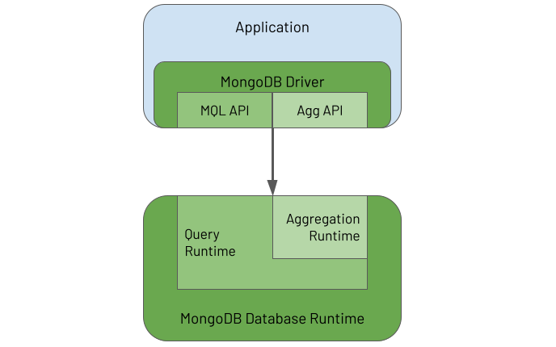
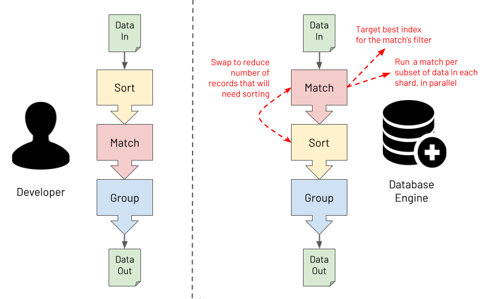
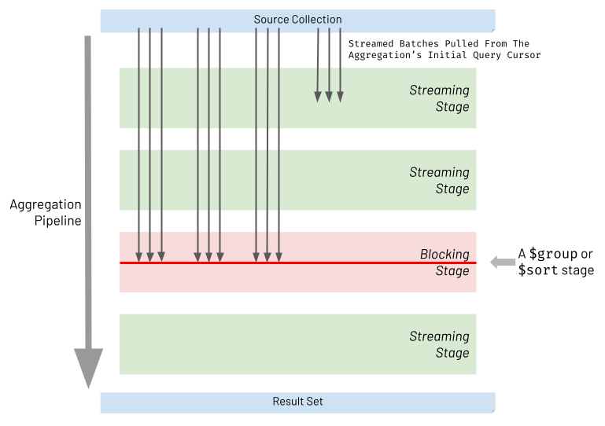

# [Practical MongoDB Aggregations](https://www.practical-mongodb-aggregations.com/front-cover.html)

## Introducing MongoDB Aggregations

Aggregation Framework compose of 2 parts:

- **Aggregations API**
  > provided by the MongoDB Driver embedded in each application to enable the application to define
  an aggregation task called a **pipeline** and send it to the database for the database to process

  -> Build pipeline task from aggregation syntax

- **Aggregation Runtime**
  > running in the database to receive the pipeline request from the application and execute the pipeline against the persisted data

  -> ie. pipeline execution



> In the database, the Aggregation Runtime reuses the Query Runtime to efficiently execute the query part of an aggregation workload that typically appears at the start of an aggregation pipeline

- Pipeline stages can be seen as functional programming.
  -> passing sets of document without side effects

> The Aggregation Framework's functional characteristics ultimately make it especially powerful for processing massive data sets.

- Database engine will optimized the pipeline!



<details>

<summary>What Do People Use The Aggregation Framework For?</summary>

- Real-time analytics
- Report generation with roll-ups, sums & averages
- Real-time dashboards
- Redacting data to present via views
- Joining data together from different collections on the "server-side"
- Data science, including data discovery and data wrangling
- Mass data analysis at scale (a la "big data")
- Real-time queries where deeper "server-side" data post-processing is required than provided by the MongoDB Query Language (MQL)
- Copying and transforming subsets of data from one collection to another
- Navigating relationships between records, looking for patterns
- Data masking to obfuscate sensitive data
- Performing the Transform (T) part of an Extract-Load-Transform (ELT) workload
- Data quality reporting and cleansing
- Updating a materialised view with the results of the most recent source data changes
- Performing full-text search (using MongoDB's Atlas Search)
- Representing data ready to be exposed via SQL/ODBC/JDBC (using MongoDB's BI Connector)
- Supporting machine learning frameworks for efficient data analysis (e.g. via MongoDB's Spark Connector)

</details>

## [History Of MongoDB Aggregations](https://www.practical-mongodb-aggregations.com/intro/history.html)

## [Embrace Composability For Increased Productivity](https://www.practical-mongodb-aggregations.com/guides/composibility.html#embrace-composability-for-increased-productivity)

## [Better Alternatives To A Project Stage](https://www.practical-mongodb-aggregations.com/guides/project.html#better-alternatives-to-a-project-stage)

- `$project` requires you to list out all fields to include / exclude when having new specified fields, ant that was irritating.
  -> use `$set` / `$unset` for better declaring field inclusion and exclusion
  (Or `$addFields` after ver 3.4, which is basically an alias of `$set`)

### When To Use `$set` / `$unset`

> when you need to retain most of the fields in the input records,
  and you want to add, modify or remove a minority subset of fields.

### When To Use $project

> when the required shape of output documents is very different from the input documents' shape.

- If you must use a $project stage, try to use it as late as possible in the pipeline
  because it is then clear to you precisely what you are asking for as the aggregation's final output.

Main Takeaway:

> In summary, you should always look to use $set (or $addFields) and $unset for field inclusion and exclusion, rather than $project.
  The main exception is if you have an obvious requirement for a **very different structure** for result documents,
  where you only need to retain a small subset of the input fields.

## [Using Explain Plans](https://www.practical-mongodb-aggregations.com/guides/explain.html#using-explain-plans)

> it is important to view the explain plan for a query to determine if you've used the appropriate index
  and if you need to optimize other aspects of the query or the data model.
  -> The same applies to aggregation pipelines!

### Viewing an Explain Plan

```js
db.coll.explain().aggregate([{"$match": {"name": "Jo"}}]);

// 3 different verbosity modes that you can generate an explain plan with:

// default
db.coll.explain("queryPlanner").aggregate(pipeline);

// most informative, provides actual statistics on the "winning" execution pla
db.coll.explain("executionStats").aggregate(pipeline);

db.coll.explain("allPlansExecution").aggregate(pipeline);
```

### Understanding The Explain Plan

Example

```js
var pipeline = [
  // Unpack each order from customer orders array as a new separate record
  {"$unwind": {
    "path": "$orders",
  }},
  
  // Match on only one customer
  {"$match": {
    "customer_id": "tonijones@myemail.com",
  }},

  // Sort customer's purchases by most expensive first
  {"$sort" : {
    "orders.value" : -1,
  }},
  
  // Show only the top 3 most expensive purchases
  {"$limit" : 3},

  // Use the order's value as a top level field
  {"$set": {
    "order_value": "$orders.value",
  }},
    
  // Drop the document's id and orders sub-document from the results
  {"$unset" : [
    "_id",
    "orders",
  ]},
];
```

Get the `queryPlanner` explain

```js
stages: [
  {
    // The $cursor runtime stage is always the first action executed for any aggregation. 
    // the aggregation engine reuses the MQL query engine to perform a "regular" query against the collection
    '$cursor': {
      queryPlanner: {
        parsedQuery: { customer_id: { '$eq': 'tonijones@myemail.com' } },
        winningPlan: {
          stage: 'FETCH',
          inputStage: {
            stage: 'IXSCAN', // index scan
            keyPattern: { customer_id: 1 },
            indexName: 'customer_id_1',
            direction: 'forward',
            indexBounds: {
              customer_id: [
                '["tonijones@myemail.com", "tonijones@myemail.com"]'
              ]
            }
          }
        },
      }
    }
  },
  
  { '$unwind': { path: '$orders' } },
  // collapsed the $sort and $limit into a single special internal sort stage for optimization
  { '$sort': { sortKey: { 'orders.value': -1 }, limit: 3 } },
  { '$set': { order_value: '$orders.value' } },  
  { '$project': { _id: false, orders: false } }
]
```

---

Get the `executionStats` explain

```js
// Because `totalKeysExamined` and `totalDocsExamined` match,
// the aggregation fully leverages this index to identify the required records.
executionStats: {
  nReturned: 1,
  totalKeysExamined: 1,
  totalDocsExamined: 1, // = 0 if cursor query is satisfied entirely using the index, and does not have to examine any raw documents
  executionStages: {
    stage: 'FETCH',
    nReturned: 1,
    works: 2,
    advanced: 1,
    docsExamined: 1,
    inputStage: {
      stage: 'IXSCAN',
      nReturned: 1,
      works: 2,
      advanced: 1,
      keyPattern: { customer_id: 1 },
      indexName: 'customer_id_1',
      direction: 'forward',
      indexBounds: {
        customer_id: [
          '["tonijones@myemail.com", "tonijones@myemail.com"]'
        ]
      },
      keysExamined: 1,
    }
  }
}
```

## [Pipeline Performance Considerations](https://www.practical-mongodb-aggregations.com/guides/performance.html#pipeline-performance-considerations)

### Be Cognizant Of Streaming Vs Blocking Stages Ordering

> For most types of stages, referred to as **streaming stages**, the database engine will take the processed
  batch from one stage and immediately stream it into the next part of the pipeline. except:

- **Blocking stages**: `$sort`, `$group`, `$facet`, `$count`, `$sortByCount`
  must block and wait for all batches to arrive and accumulate together at that stage.
  - increase aggregation execution time by reducing concurrency
  - significantly increase memory consumption



- MongoDB enforces that every blocking stage is limited to 100 MB of consumed RAM
  (to lift the limit: `allowDiskUse:true`)

#### $sort Memory Consumption And Mitigation

- Use Index Sort
  Move the $sort stage to near the start of your pipeline to target an index for the sort.

- Use Limit With Sort
  - Add a `$limit` stage directly after the `$sort` stage
  - At runtime, the aggregation engine will collapse the `$sort` and `$limit` into a single special internal sort stage which performs both actions together.

- Reduce Records To Sort
  Move the `$sort` stage to as late as possible in your pipeline and
  ensure earlier stages significantly reduce the streaming data into blocking $sort stage.

#### $group Memory Consumption And Mitigation

- Avoid Unnecessary Grouping
- Group Summary Data Only

### Avoid Unwinding & Regrouping Documents Just To Process Array Elements

Instead of `$unwind` and `$grouping`...

```js
var pipeline = [
  // Unpack each product from the each order's product as a new separate record
  {"$unwind": {
    "path": "$products",
  }},

  // Match only products valued over 15.00
  {"$match": {
    "products.price": {
      "$gt": NumberDecimal("15.00"),
    },
  }},

  // Group by product type
  {"$group": {
    "_id": "$_id",
    "products": {"$push": "$products"},
  }},
];
```

...Use Array Operators instead!

```js
var pipeline = [
  // Filter out products valued 15.00 or less
  {"$set": {
    "products": {
      "$filter": {
        "input": "$products",
        "as": "product",
        "cond": {"$gt": ["$$product.price", NumberDecimal("15.00")]},
      }
    },
  }},
];
```

### Encourage Match Filters To Appear Early In The Pipeline

- Explore If Bringing Forward A Full Match Is Possible

Suboptimal: `$set` then `$match`

```js
var pipeline = [
  {"$set": {
    "value_dollars": {"$multiply": [0.01, "$value"]}, // Converts cents to dollars
  }},
  
  {"$unset": [
    "_id",
    "value",
  ]},

  {"$match": {
    "value_dollars": {"$gte": 100},  // Peforms a dollar check
  }},
];
```

Optimal:

```js
var pipeline = [
  {"$match": {                // Moved to before the $unset
    "value": {"$gte": 10000}, // Changed to perform a cents check, and this utilize index if present
  }},
  {"$set": {
    "value_dollars": {"$multiply": [0.01, "$value"]},
  }},
  {"$unset": [
    "_id",
    "value",
  ]}, 
];
```

- Explore If Bringing Forward A Partial Match Is Possible

## [Expressions Explained](https://www.practical-mongodb-aggregations.com/guides/expressions.html)

### Summarizing Aggregation Expressions

> Expressions give aggregation pipelines their data manipulation power.

Expressions come in one of 3 primary flavors:

- Operators (`$cond`, `$arrayElemAt`, `$dateToString`, etc)
- Field Paths
- Variables: accessed with `$$` prefix
  - Context System Variables (`$$NOW`, `$$CLUSTER_TIME`)
  - Marker Flag System Variables (`$$ROOT`, `$$REMOVE`, `$$PRUNE`)
    - `$$REMOVE`: instructing the pipeline to exclude the field.
  - Bind User Variables (used in `$let`, `$map`, `$filter`)

### What Do Expressions Produce?

> An expression is just something that dynamically populates and returns a new JSON/BSON data type element.

```js
{"$dayOfWeek": ISODate("2021-04-24T00:00:00Z")}
{"$dayOfWeek": "$person_details.data_of_birth"}
{"$dayOfWeek": "$$NOW"}
{"$dayOfWeek": {"$dateFromParts": {"year" : 2021, "month" : 4, "day": 24}}}
```

### Can All Stages Use Expressions?

Stages that don't allow expressions to be embedded.

- `$match` -> most important in aggregation
- `$limit`
- `$skip`
- `$sort`
- `$count`
- `$lookup`
- `$out`

### What Is Using `$expr` Inside $match All About?

> Inside a $expr operator, you can include any composite expression fashioned from $ operator functions, $ field paths and $$ variables.

```js
{"$match": {
  "$expr": {"$gt": [{"$multiply": ["$width", "$height"]}, 12]},
}}
```

#### Restrictions When Using Expressions with $match

## [Advanced Use Of Expressions For Array Processing](https://www.practical-mongodb-aggregations.com/guides/advanced-arrays.html)

> When optimizing for performance, these array expressions are critical to avoid unwinding and regrouping documents
  where you only need to process each document's array.

### "If-Else" Conditional Comparison

```js
{"$set": {
  "cost": {
    "$cond": { 
      "if":   {"$gte": ["$qty", 5]}, 
      "then": {"$multiply": ["$price", "$qty", 0.9]},
      "else": {"$multiply": ["$price", "$qty"]},
    }    
  },
}}
```

### The "Power" Array Operators

`$reduce` and `$map`

### "For-Each" Looping To Transform An Array

```js
{"$set": {
  "products": {
    "$map": {
      "input": "$products",
      "as": "product",
      "in": {"$toUpper": "$$product"}
    }
  }
}}
```

### "For-Each" Looping To Compute A Summary Value From An Array

```js
{"$set": {
  "productList": {
    "$reduce": {
      "input": "$products",
      "initialValue": "",
      "in": {
        "$concat": ["$$value", "$$this", "; "] // `$$value` operator represents the passing argument
      }            
    }
  }
}}
```

### "For-Each" Looping To Locate An Array Element

```js
{"$set": {
  "firstLargeEnoughRoomArrayIndex": {
    "$reduce": {
      "input": {"$range": [0, {"$size": "$room_sizes"}]},
      "initialValue": -1,
      "in": {
        "$cond": { 
          "if": {
            "$and": [
              // IF ALREADY FOUND DON'T CONSIDER SUBSEQUENT ELEMENTS
              {"$lt": ["$$value", 0]}, 
              // IF WIDTH x LENGTH > 60
              {"$gt": [
                {"$multiply": [
                  {"$getField": {"input": {"$arrayElemAt": ["$room_sizes", "$$this"]}, "field": "width"}},
                  {"$getField": {"input": {"$arrayElemAt": ["$room_sizes", "$$this"]}, "field": "length"}},
                ]},
                60
              ]}
            ]
          }, 
          // IF ROOM SIZE IS BIG ENOUGH CAPTURE ITS ARRAY POSITION
          "then": "$$this",  
          // IF ROOM SIZE NOT BIG ENOUGH RETAIN EXISTING VALUE (-1)
          "else": "$$value"  
        }            
      }            
    }
  }
}}

// OR asking for elem itself, not idx
{"$set": {
  "firstLargeEnoughRoom": {
    "$first": {
      "$filter": { 
        "input": "$room_sizes", 
        "as": "room",
        "cond": {
          "$gt": [
            {"$multiply": ["$$room.width", "$$room.length"]},
            60
          ]
        } 
      }    
    }
  }
}}
```

### Reproducing $map Behavior Using $reduce

```js
{"$set": {
  "deviceReadings": {
    "$reduce": {
      "input": "$readings",
      "initialValue": [],
      "in": {
        "$concatArrays": [
          "$$value",
          {"$cond": { 
            "if": {"$gte": ["$$this", 0]},
            "then": [{"$concat": ["$device", ":", {"$toString": "$$this"}]}],  
            "else": []
          }}                                    
        ]
      }
    }
  }
}}
```

### Adding New Fields To Existing Objects In An Array

```js
{"$set": {
  "items": {
    "$map": {
      "input": "$items",
      "as": "item",
      "in": {
        "product": "$$item.product",
        "unitPrice": "$$item.unitPrice",
        "qty": "$$item.qty",
        "cost": {"$multiply": ["$$item.unitPrice", "$$item.qty"]}},
      }
    }
  }
}

// Or better way, mergeObject
{"$set": {
  "items": {
    "$map": {
      "input": "$items",
      "as": "item",
      "in": {
        "$mergeObjects": [
          "$$item",            
          {"cost": {"$multiply": ["$$item.unitPrice", "$$item.qty"]}},
        ]
      }
    }
  }
}}

// OR using a more verbose one
// if you need to dynamically set the name of an array item's field
{"$set": {
  "items": {
    "$map": {
      "input": "$items",
      "as": "item",
      "in": {
        "$arrayToObject": {
          "$concatArrays": [
            {"$objectToArray": "$$item"},            
            [{
                "k": {"$concat": ["costFor", "$$item.product"]},
                "v": {"$multiply": ["$$item.unitPrice", "$$item.qty"]},
            }]
          ]
        }
      }
    }
  }}
}
```

### Rudimentary Schema Reflection Using Arrays

```js
{"$project": {
  "_id": 0,
  "schema": {
    "$map": {
      "input": {"$objectToArray": "$$ROOT"},
      "as": "field",
      "in": {
        "fieldname": "$$field.k",
        "type": {"$type": "$$field.v"},          
      }
    }
  }
}}
```

```js
{"$project": {
  "_id": 0,
  "schema": {
    "$map": {
      "input": {"$objectToArray": "$$ROOT"},
      "as": "field",
      "in": {
        "fieldname": "$$field.k",
        "type": {"$type": "$$field.v"},          
      }
    }
  }
}},

{"$unwind": "$schema"},

{"$group": {
  "_id": "$schema.fieldname",
  "types": {"$addToSet": "$schema.type"},
}},

{"$set": {
  "fieldname": "$_id",
  "_id": "$$REMOVE",
}},
```
